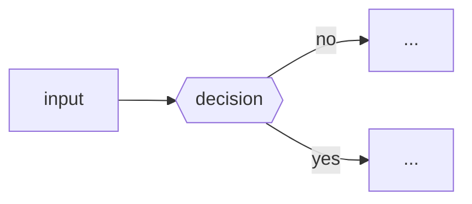

<!--
Title: use a prefix — feat: / fix: / docs: / chore: / refactor:
Keep this description short and scannable. A reviewer with zero context
should grok it in under a minute. Delete sections that don't apply.
-->

<!-- Lede: one or two sentences — what this PR does AND why it exists.
     No "This PR…", no restating the title. -->

## Diagram
<!-- Include only if the change has shape worth seeing: data flow, decision
     logic, state machine, architecture, or before/after. Otherwise delete
     this whole section. Quote labels containing () : & < > etc. -->

## What's here
<!-- Map each load-bearing file/module to its role. Not a file dump. -->
- **path/to/file.ts** — its role in one line.

## Gates / verification
<!-- Concrete proof, numbers not adjectives. -->
- [ ] `bun test` ✅
- [ ] typecheck ✅
- [ ] lint 0 errors
- [ ] changeset added (if a `@dreki-gg/*` package changed)

## Caveats
<!-- Honest trade-offs, follow-ups, and expected-but-surprising signals.
     Quote intentional noise so reviewers don't re-discover it as a "problem." -->

## Links
<!-- Closes #123, related PRs, spec/companion docs, the plan. -->
- Closes #
